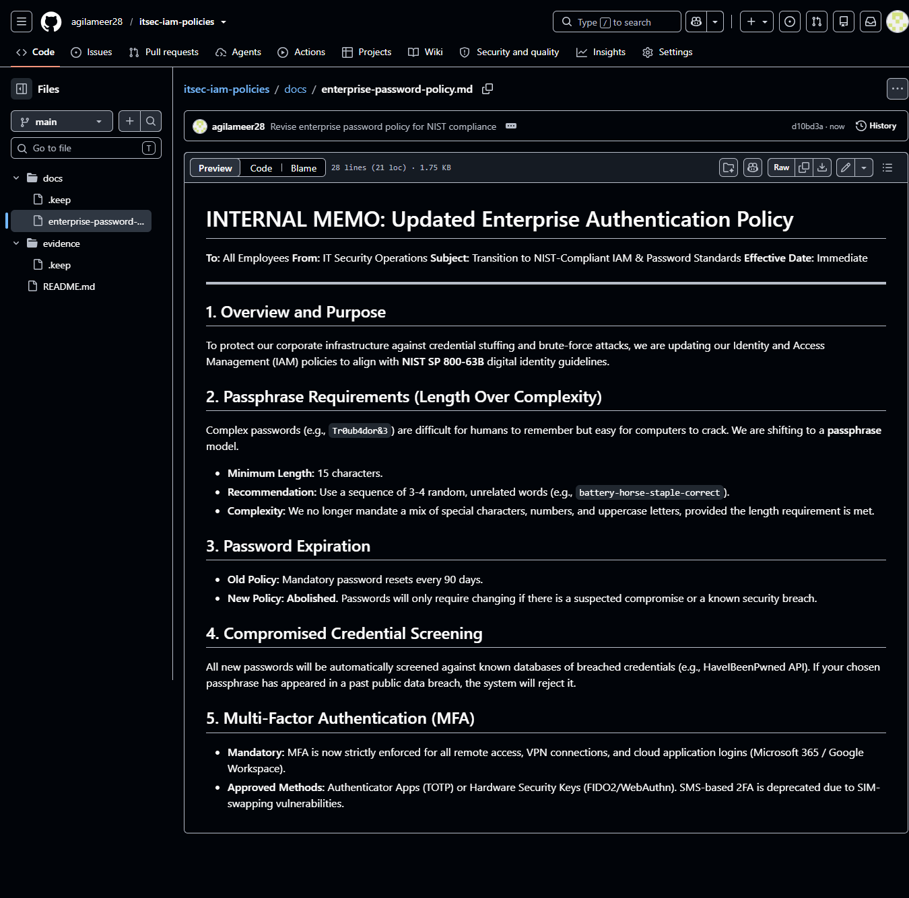

### Summary
Drafted an internal Identity and Access Management (IAM) policy aligning legacy authentication frameworks with modern NIST SP 800-63B guidelines.

### Environment
* **Platform:** GitHub (Markdown Documentation)
* **Concepts:** IAM, NIST Compliance, Multi-Factor Authentication (MFA), Credential Screening, Role-Based Access Control (RBAC) principles.

### Diagnostic / Execution Steps
1. Researched NIST SP 800-63B digital identity guidelines for modern authentication standards.
2. Authored an internal Markdown memo deprecating outdated practices (90-day resets, arbitrary complexity) in favor of length-based passphrases.
3. Integrated MFA mandates and automated breached-credential screening into the standard operating procedure.

### Evidence

### Lessons Learned
Compliance frameworks like NIST dictate modern enterprise security. Transitioning from complex, frequently rotated passwords to long, static passphrases backed by MFA significantly reduces the attack surface while improving user experience.
